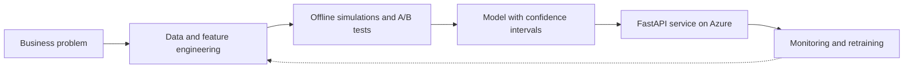
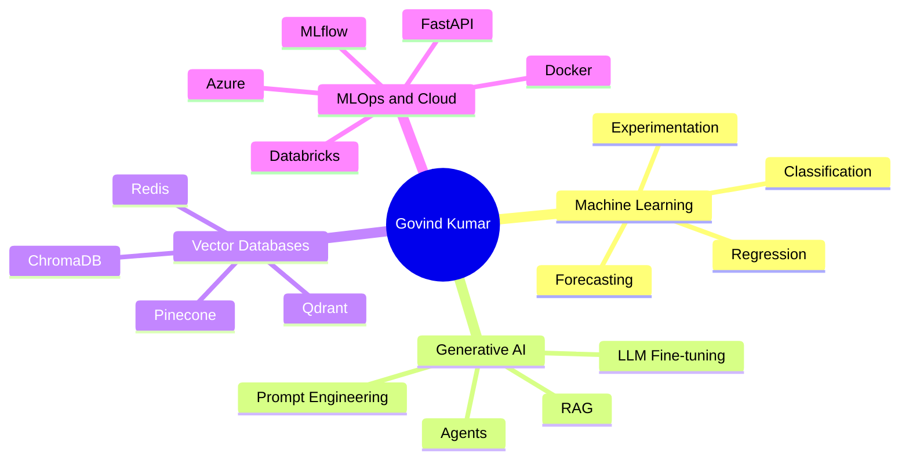

<!-- Resume & LeetCode links (kept from original)
[Resume](https://app.flowcv.io/resume-feedback/lwsSgpn3kI-ZeqS7B9k6U)
[Leetcode](https://leetcode.com/govind97/)
-->

  

<h2 align="center">Hi, I'm Govind Kumar! Great to see you here! </h2>

  

  
  
  
  
  

  

## About Me 😄😃
I am Govind Kumar, completed Master's in Mathematics and Scientific Computing from [National Institute of Technology Warangal](https://www.nitw.ac.in/). I am a Tech enthusiast, Explorer, and open-source Contributor. I am always open to collaborating on projects and innovative/disruptive ideas.

I'm an **AI Engineer / Data Scientist based in New Delhi, India**, with 3+ years of experience taking ML and GenAI systems from proof-of-concept to production: revenue forecasting, A/B testing, RAG pipelines, and agentic AI workflows on Azure and Databricks.

💬 I love Playing Badminton and exploring New Places.

👯 I'm looking to collaborate on Open-Source Projects

🌱 I'm currently experimenting with Machine Learning, Deep learning, LLMs, Agentic AI, Cloud Native Technologies...

🤔 **I'm Open to Work on Domain like Software Development, DevOps, Data Science/ML, and AI/GenAI Engineering (remote preferred)**

Find out more about me & feel free to connect with me here:

	
	
	
	
	

---

## 🎯 Quick Snapshot

<table>
  <tr>
    <td width="25%" valign="top">
      <h4>🔭 Building</h4>
      <ul>
        <li>Multi-agent workflows (CrewAI, LangGraph)</li>
        <li>Production RAG with vector DBs</li>
        <li>LLM-powered automation</li>
      </ul>
    </td>
    <td width="25%" valign="top">
      <h4>🌱 Exploring</h4>
      <ul>
        <li>Machine Learning &amp; Deep Learning</li>
        <li>LLMs &amp; Agentic AI</li>
        <li>Cloud Native technologies</li>
      </ul>
    </td>
    <td width="25%" valign="top">
      <h4>💬 Ask me about</h4>
      <ul>
        <li>Forecasting &amp; A/B testing</li>
        <li>RAG &amp; vector databases</li>
        <li>Shipping ML to production</li>
      </ul>
    </td>
    <td width="25%" valign="top">
      <h4>🏸 Off-screen</h4>
      <ul>
        <li>Badminton</li>
        <li>Exploring new places</li>
        <li>Open-source collaboration</li>
      </ul>
    </td>
  </tr>
</table>

---

## 🧭 What I Do

| 📈 Forecasting & Experimentation | 🤖 GenAI & Agents | ⚙️ MLOps & Production |
|---|---|---|
| Revenue forecasting with confidence intervals | RAG pipelines with vector databases | FastAPI inference services on Azure |
| Offline simulations and controlled A/B tests | Multi-agent workflows (CrewAI, LangGraph) | Databricks pipelines and retraining |
| Regression, classification, statistical modelling | LLM fine-tuning and prompt engineering | MLflow tracking, Docker, monitoring |

### 🔄 How I ship ML systems

### 🧠 Skills map

---

## ⚡ Tech Stack

### 🚀 Languages/Database/Scripting

### 💻 Libraries & Framework(Mostly ML/DL)

### 📊 ML, Statistics & Experimentation

### 🤖 Generative AI & Agents

### 🗄️ Vector Databases

### ☁️ Cloud, MLOps & Serving

### 🧑🏻‍💻 Tools & Platform

---

## 📈 Stats

GitHub Contribution Chart

    

    

    <picture>
      <source media="(prefers-color-scheme: dark)" srcset="https://raw.githubusercontent.com/govind527/govind527/output/github-snake-dark.svg" />
      <source media="(prefers-color-scheme: light)" srcset="https://raw.githubusercontent.com/govind527/govind527/output/github-snake.svg" />
      
    </picture>

GitHub Stats

    
    

    

## ✍️ Latest Blog Posts
<!-- BLOG-POST-LIST:START -->
- [The Stack Overflow 2017 survey](https://medium.com/@govindkumarnavik97/the-stack-overflow-2017-survey-54a9745504fc)

<!-- BLOG-POST-LIST:END -->

## My Recent Github Activity ⚡
<!--START_SECTION:activity-->
1. ❗️ Closed issue [#3](https://github.com/govind527/github-upload/issues/3) in [govind527/github-upload](https://github.com/govind527/github-upload)
2. 🗣 Commented on [#3](https://github.com/govind527/github-upload/issues/3) in [govind527/github-upload](https://github.com/govind527/github-upload)
3. ❗️ Reopened issue [#3](https://github.com/govind527/github-upload/issues/3) in [govind527/github-upload](https://github.com/govind527/github-upload)
4. ❗️ Closed issue [#3](https://github.com/govind527/github-upload/issues/3) in [govind527/github-upload](https://github.com/govind527/github-upload)
5. 🗣 Commented on [#3](https://github.com/govind527/github-upload/issues/3) in [govind527/github-upload](https://github.com/govind527/github-upload)
<!--END_SECTION:activity-->

---

## 📕 Pinned Repositories

<table>
  <tr>
    <td width="50%" valign="top">
      <h4><a href="https://github.com/govind527/Upscale-Image">🖼️ Upscale-Image</a></h4>
      
Image upscaling project: enhancing low-resolution images.

      
      
      
      
    </td>
    <td width="50%" valign="top">
      <h4><a href="https://github.com/govind527/Toxicity-classification-NLP">🧪 Toxicity-classification-NLP</a></h4>
      
NLP classifier for detecting toxic comments in text.

      
      
      
      
    </td>
  </tr>
  <tr>
    <td width="50%" valign="top">
      <h4><a href="https://github.com/govind527/Analytics-Vidhya-Jobathon-May-2021-Credit-Card-Lead-Prediction">💳 Credit-Card-Lead-Prediction</a></h4>
      
Analytics Vidhya Jobathon (May 2021): predicting credit card leads.

      
      
      
      
    </td>
    <td width="50%" valign="top">
      <h4><a href="https://github.com/govind527/whatsapp-chat-analyzer">💬 whatsapp-chat-analyzer</a></h4>
      
Analyse exported WhatsApp chats: activity, words and trends.

      
      
      
      
    </td>
  </tr>
  <tr>
    <td width="50%" valign="top">
      <h4><a href="https://github.com/govind527/Data-Scientist-Blogpost-Project">📝 Data-Scientist-Blogpost-Project</a></h4>
      
Data analysis project written up as a blog post.

      
      
      
      
    </td>
    <td width="50%" valign="top">
      <h4><a href="https://github.com/govind527/Business-Startup-Success-Prediction">🚀 Business-Startup-Success-Prediction</a></h4>
      
ML model predicting whether a startup will succeed.

      
      
      
      
    </td>
  </tr>
</table>

<a href="https://github.com/govind527?tab=repositories">📂 Browse all repositories →</a>

---

## Here is a random joke that'll make you laugh!

  

Refresh page to load New joke

## 🤝 Let's Build Something

  Got an idea in <b>forecasting, GenAI, agents or MLOps</b>? Let's talk.  
  
  

<i>⭐ If something here helped you, drop a star on a repo. Always learning, always shipping.</i>

  

  

